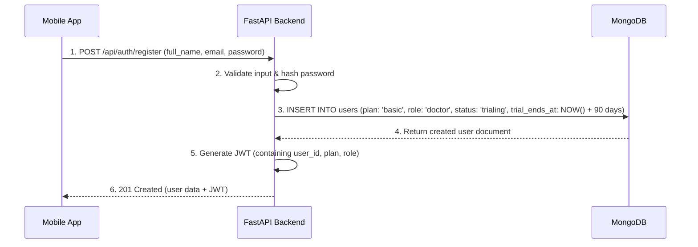
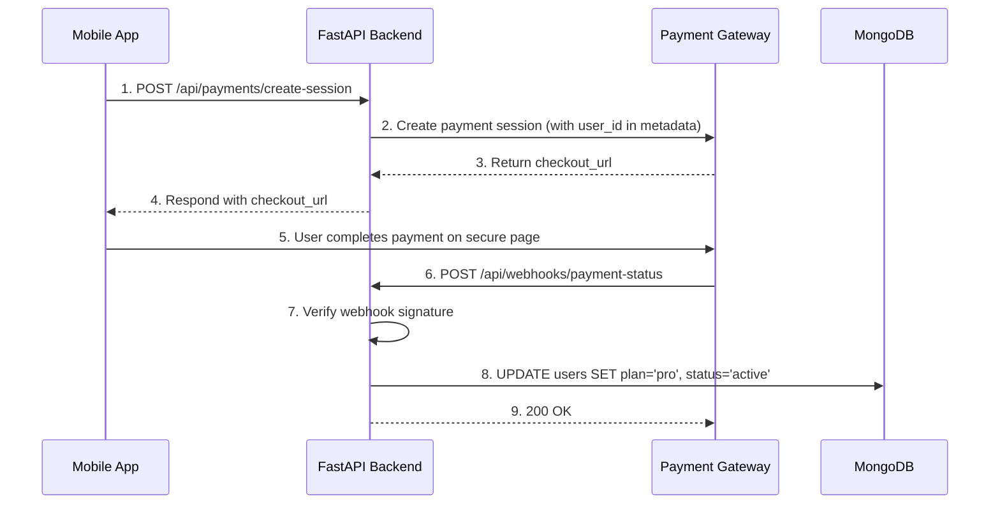

# Planning

This document outlines the technical architecture, data models, core workflows, and roadmap for the Clinic OS Lite application.

## Technical Architecture

### Overview

This document outlines the technical architecture, data models, and core workflows for the **Clinic OS Lite** application. It serves as a guide for understanding the system's design and components.

### High-Level System Architecture

#### Architectural Overview
The application uses a decoupled, three-tier architecture. The core is a **FastAPI backend** that serves as the single source of truth and handles all business logic. It communicates with a **cross-platform React Native client** that targets iOS, Android, and Web, providing a consistent user experience across devices. A separate, pro-only web dashboard is planned for future development.

#### Architectural Diagram
```mermaid
graph TD
    subgraph "Clients (User-Facing Layer)"
        A[<b>Cross-Platform App (React Native)</b><br><i>Targets: iOS, Android & Web</i><br>Handles core patient management for all users.]
        B[<b>Pro Web Dashboard (React.js)</b><br><i>Status: Planned</i><br>Provides advanced analytics and data management for Pro users.]
    end

    subgraph "Backend Service (Application Layer)"
        C{<b>FastAPI Backend API</b><br><i>Central Business Logic</i><br>Stateless REST API handling authentication, data processing, and external service integration.}
    end

    subgraph "Managed Services (Data & Infrastructure Layer)"
        D[<b>MongoDB Atlas</b><br><i>Primary Datastore</i><br>NoSQL database for user and patient data.]
        E[<b>Payment Gateway (e.g., Stripe)</b><br><i>Subscription Management</i><br>Handles secure payment processing and subscription events via webhooks.]
        F[<b>Cloud Storage (e.g., AWS S3)</b><br><i>File Storage (Pro Feature)</i><br>Stores user-uploaded documents like lab reports.]
    end

    A -- "REST API Calls (HTTPS, JWT)" --> C
    B -- "REST API Calls (HTTPS, JWT)" --> C
    C -- "Database Operations (Motor)" --> D
    C -- "Webhooks & API Calls" --> E
    C -- "Secure File Operations (SDK)" --> F
```

#### Architectural Principles
- **Stateless Backend:** The FastAPI application is stateless, enabling seamless horizontal scaling. State is managed via JWTs or retrieved from the database on demand.
- **Secure by Design:** Communication is enforced over HTTPS. Authentication relies on JWTs. Authorization is handled at the API level using a **Role-Based Access Control (RBAC)** system and pro-tier feature flags. The API is also protected from abuse via **rate limiting**.
- **Offline-First:** The React Native client uses WatermelonDB to provide a robust offline experience, synchronizing data with the backend via a dedicated sync API.

### Component Breakdown

#### Backend Service (FastAPI)
- **Role:** The central brain of the application. It is responsible for all business logic, data persistence, user authentication, and secure communication with third-party services.
- **Core Technologies:** Python 3.9+, FastAPI, Pydantic, Motor, `python-jose` and `passlib` for JWT authentication, and `slowapi` for rate limiting.
- **Status:** Largely complete. Provides APIs for authentication, patient management, clinical notes, data synchronization, and payments. Includes a robust RBAC system and protected endpoints for pro-tier features.

#### Cross-Platform Client (React Native)
- **Role:** The primary interface for all users on iOS, Android, and Web. It is optimized for both mobile and desktop use, focusing on daily tasks like patient management and note-taking.
- **Core Technologies:** React Native, Expo, Zustand, WatermelonDB, Expo Router.
- **Status:** In development. Core features like authentication, offline-first data sync, patient management, and the upgrade-to-pro flow are implemented. Document management UI is pending.
- **Architecture:** The Android build utilizes the **React Native New Architecture** to support the latest native modules.

#### Pro Web Dashboard (React.js)
- **Role:** A premium, Pro-exclusive interface designed for desktop use. It will provide a broader, more analytical view of the practice.
- **Core Technologies:** React.js (or a framework like Next.js), a component library (e.g., MUI), and a charting library (e.g., Recharts).
- **Status:** Planned. This application has not been built yet.

### Data Models (MongoDB Schema)
The application enforces a consistent data structure using Pydantic models.

#### `users` Collection
Stores information about the medical professionals using the service.
```json
{
  "_id": "String (UUID)",
  "email": "String (Unique, Indexed)",
  "password_hash": "String",
  "full_name": "String",
  "phone": "String",
  "medical_specialty": "String",
  "plan": "String (Enum: 'basic', 'pro', Default: 'basic')",
  "role": "String (Enum: 'admin', 'doctor', Default: 'doctor')",
  "subscription_status": "String (Enum: 'trialing', 'active', 'canceled', 'past_due', Default: 'trialing')",
  "subscription_end_date": "ISODate",
  "created_at": "ISODate",
  "updated_at": "ISODate"
}
```

#### `patients` Collection
Stores demographic and contact information for each patient.
```json
{
  "_id": "String (UUID)",
  "patient_id": "String (Auto-Incrementing, e.g., PAT001)",
  "user_id": "String (Indexed, Foreign key to `users`)",
  "name": "String",
  "phone": "String",
  "email": "String",
  "address": "String",
  "location": "String",
  "initial_complaint": "String",
  "initial_diagnosis": "String",
  "group": "String",
  "is_favorite": "Boolean",
  "created_at": "ISODate",
  "updated_at": "ISODate"
}
```

#### `clinical_notes` Collection
Stores timestamped clinical entries for each patient.
```json
{
  "_id": "String (UUID)",
  "patient_id": "String (Indexed, Foreign key to `patients`)",
  "user_id": "String (Indexed, Foreign key to `users`)",
  "content": "String",
  "visit_type": "String (Enum: 'regular', 'follow-up', 'emergency')",
  "created_at": "ISODate"
}
```

#### `documents` Collection (Pro Feature)
Stores metadata about files uploaded by Pro users. The files themselves are stored in a separate cloud storage service.
```json
{
  "_id": "ObjectId",
  "patient_id": "ObjectId (Indexed)", // Foreign key to `patients`
  "user_id": "ObjectId (Indexed)", // Foreign key to `users`
  "file_name": "String",
  "storage_key": "String", // Unique key/path in cloud storage
  "content_type": "String",
  "size_bytes": "Number",
  "uploaded_at": "ISODate"
}
```

### Core Workflows
This section outlines key user journeys.

#### User Registration & Trial Activation
A new user is registered and automatically placed on a 90-day trial with a default role of `DOCTOR`.


#### Subscription Upgrade Flow
A user on a Basic/Trial plan upgrades to a paid Pro plan.


### Deployment & Environment

#### Backend Directory Structure
The backend code is organized into a clean, service-oriented structure within `backend/app/`.
- **`api/`**: API endpoint definitions (routers), decorated with rate limits.
- **`core/`**: Core application logic, configuration, and security (`security.py` for RBAC, `limiter.py` for rate limiting).
- **`db/`**: Database session management and initialization.
- **`models/`**: Pydantic models for database collections.
- **`schemas/`**: Pydantic schemas for API request/response validation.
- **`services/`**: Business logic, separated from the API layer.

#### Production Recommendations
- **Web Server:** A production-grade ASGI server like Gunicorn with Uvicorn workers, running in a container.
- **Database:** A managed MongoDB cluster (e.g., MongoDB Atlas) is strongly recommended for automated backups, scaling, and monitoring.
- **Caching:** The application uses an in-memory, least-recently-used (LRU) cache via the `@alru_cache` decorator on service-layer functions. This is suitable for single-instance deployments. For multi-instance or serverless deployments, an external caching layer like Redis would be required. A debug endpoint (`/api/debug/clear-all-caches`) is available for clearing all caches during testing.
- **Monitoring:** A solution like Prometheus/Grafana or a commercial APM (e.g., Datadog) to track performance.
- **Logging:** Centralized logging (e.g., ELK stack, Google Cloud Logging).
- **CI/CD:** An automated pipeline (e.g., GitHub Actions) for testing and deployment.

## Project Roadmap

This document outlines the development status and future roadmap for all components of the Clinic OS Lite application. It serves as the single source of truth for tracking progress toward the beta release and beyond.

**CURRENT STATUS: UNBLOCKED.** Frontend development for iOS, Android, and Web can now proceed. The critical Android build failure has been resolved.

### Cross-Platform App (React Native for iOS, Android & Web)

#### ✅ Completed Features
- **Core Subscription & Auth:**
  - [x] Integrated Zustand for global state management (user, plan, status).
  - [x] Login flow correctly hydrates state from the backend JWT.
  - [x] Fixed critical state hydration issue to prevent infinite loading screens.
- **Conditional UI:**
  - [x] Profile screen displays the user's current plan and trial status.
  - [x] Pro-level features (e.g., Document Uploads) are visually locked for Basic/Trial users.
  - [x] UI elements like "Upgrade" buttons are displayed conditionally.
- **Payment Integration:**
  - [x] A dedicated "Upgrade" screen outlines Pro plan benefits.
  - [x] The checkout flow is implemented, securely calling the backend to create a payment session.
- **Data Layer & Offline-First:**
  - [x] **WatermelonDB:** Fully configured for both iOS and Web, providing a robust offline-first data layer.
  - [x] **Data Synchronization:** The app now correctly uses the backend's `/api/sync/pull` and `/api/sync/push` endpoints to keep local and remote data in sync.
- **Forms & Validation:**
    - [x] Implemented `react-hook-form` and `zod` for robust, schema-based validation on patient forms.

#### ⏳ Pending Features
- **Document Management (Pro Feature):**
  - [ ] Implement the document upload UI on the patient detail screen.
  - [ ] Implement a view to list and manage a patient's uploaded documents.
- **General Improvements:**
  - [ ] **UI/UX:** Add haptic feedback and more advanced loading skeletons.

### Web Dashboard (React.js) - *New Build*

This is a new, Pro-exclusive application to be built from scratch.

#### ⏳ Pending Features

- **Core Architecture:**
  - [ ] Set up a new React.js project (e.g., with Next.js).
  - [ ] Implement shared authentication logic to connect to the existing backend.
  - [ ] Implement a "Pro User" route guard to protect the entire dashboard.
- **Feature Development:**
  - [ ] **Analytics Dashboard:** Develop components to visualize key practice metrics from the `/api/analytics` endpoints.
  - [ ] **Advanced Patient Management:** Build a comprehensive data grid (e.g., MUI X, AG Grid) for searching, sorting, and filtering patients.
  - [ ] **Appointment Calendar:** Implement a full-featured calendar for appointment management using a library like FullCalendar. *(Depends on: Backend Appointments API)*

### Backend (FastAPI)

#### ✅ Completed Features

- **Core APIs:**
  - [x] User Authentication and Registration.
  - [x] Patient and Clinical Note Management (CRUD).
- **Subscription & Payments:**
  - [x] Payment gateway integration for creating checkout sessions.
  - [x] Webhook endpoint to handle payment status updates.
- **Pro-Tier APIs:**
  - [x] API endpoints for `Documents` and `Analytics` are implemented and protected.
- **Security & Stability:**
  - [x] **RBAC:** Finalized and polished Role-Based Access Control. New users are correctly assigned the `DOCTOR` role.
  - [x] **Rate Limiting:** Implemented rate limiting across all major API endpoints.
  - [x] **Server-Side Validation:** Enhanced validation for patient and clinical note data.
  - [x] **Caching:** Implemented a debug endpoint to clear all caches, resolving a critical data access issue in the test environment.

- **Data Synchronization API:**
  - [x] Implemented `/api/sync/pull` and `/api/sync/push` endpoints required by the frontend's WatermelonDB client.

#### ⏳ Pending Features
- **Core Functionality:**
  - [ ] **Appointments:** Develop API endpoints for appointment management.
  - [ ] **Image Storage:** Integrate with a cloud storage service (e.g., AWS S3, Cloudinary) for document files.

### General / Cross-Cutting Concerns

- [x] **Error Handling:** Integrated Sentry for error monitoring across both frontend and backend.
- [ ] **Performance:** Conduct performance analysis and implement optimizations like code splitting.
- [ ] **Accessibility:** Enhance accessibility to meet standard guidelines (WCAG).

## Android Beta MVP Scope

**Objective:** Define the minimum viable feature set for a stable and successful Android beta release in 10-14 days.

### Beta MVP Feature List (Minimum Viable)
This list represents the core functionality that must be stable and working for the beta release.

- **Authentication & User Management:**
  - [x] User registration and login
  - [x] Secure session management (JWT)
  - [x] Profile screen displaying plan/trial status
- **Patient Management:**
  - [x] Create, Read, Update, Delete (CRUD) patients
- **Clinical Notes:**
  - [x] Add and view clinical notes for each patient
- **Offline Synchronization:**
  - [x] Robust data sync between the device (WatermelonDB) and the backend server
- **UI/UX:**
  - [x] Dark Mode support
  - [x] Basic responsive layout for different Android screen sizes

### Deferred to v1.1 (Post-Beta)
To ensure a focused and stable beta, the following features will be deferred.

- **Document Management (Pro Feature):**
  - Document uploads, viewing, and management.
- **Appointments System:**
  - API and UI for scheduling and managing appointments.
- **Web Dashboard:**
  - The entire web-based dashboard for Pro users.
- **Advanced Analytics:**
  - Detailed analytics and visualizations.
- **UI/UX Enhancements:**
  - Advanced animations, haptic feedback, and loading skeletons.

### Beta-Specific Additions Needed
These features are critical for managing the beta program effectively.

- **🔴 In-App Feedback Form:** A simple form to allow beta users to submit feedback and bug reports directly within the app.
- **✅ Error Reporting Integration:** Integrated Sentry for error monitoring.
- **🟡 Beta User Welcome Screen:** A one-time welcome screen that thanks users for participating and provides key information.
- **🟡 Known Issues Disclaimer:** A small, accessible screen or notice that lists known issues to manage user expectations.
- **🟡 "Report a Bug" Button:** A persistent, easily accessible button (e.g., in the app settings) that links to the feedback form.

### Pre-Launch Checklist
A final checklist to ensure all critical tasks are completed before the launch.

- [ ] **Android Build:** Confirm the Android release build is working and can be installed on test devices.
- [ ] **Demo Accounts:** Test the entire user flow with all provided demo/beta accounts.
- [ ] **Backend Tests:** Ensure all backend tests are passing (100% coverage on critical paths).
- [ ] **Security Audit:** Perform a final review of authentication, authorization, and data handling.
- [ ] **API Configuration:** Verify API rate limits and production environment settings are correctly configured.
- [ ] **Database Backups:** Confirm that the automated database backup mechanism is active and tested.
- [x] **Error Monitoring:** Ensure the selected error monitoring service is active and correctly configured.
- [ ] **Feedback Mechanism:** Verify the in-app feedback form is functional and sending data to the expected destination.

### Proposed Timeline
A high-level timeline to guide the final push to beta.

- **Days 1-3:** **Blocker Resolution (Android Build & Stability)**
  - Final testing and confirmation of the Android build process.
  - Address any remaining critical stability issues.
- **Days 4-5:** **Beta-Specific Features**
  - Implement the in-app feedback form and error reporting integration.
- **Days 6-7:** **Intensive Testing & Security Review**
  - Conduct a full regression test of all MVP features.
  - Complete the security audit.
- **Days 8-9:** **Deployment & Configuration**
  - Deploy the production-ready backend.
  - Configure all required services (database, error monitoring, etc.).
- **Days 10-11:** **Beta User Onboarding Preparation**
  - Prepare welcome emails, documentation, and test accounts for beta users.
- **Days 12-14:** **Soft Launch & Monitoring**
  - Distribute the app to the beta group and closely monitor for issues.

## Beta Release Plan: Android & Basic Plan Users

### Introduction
This document outlines the strategy, current status, and remaining work required to launch a beta version of the Clinic OS Lite application. The primary target for this beta release is **Android users on the Basic/Trial plan**. The goal is to provide a stable, feature-complete mobile experience for patient management.

### Target Audience & Scope
- **Platform:** Android
- **Subscription Tier:** Basic Plan (including 90-day trial users)
- **Core Functionality:** The beta will include all features available under the Basic plan:
    - Secure user authentication
    - Full CRUD (Create, Read, Update, Delete) for patient records
    - Clinical note management
    - Offline data storage and automatic synchronization

Pro-tier features, such as document management and the web dashboard, are out of scope for this initial beta.

### Current Status & Major Blockers

#### Overall Status
**READY FOR TESTING.** The application's backend and frontend are now stable and feature-complete for the beta's scope. The critical Android build failure has been resolved, unblocking the path to release.

#### Critical Blocker Resolved
**Android Build Failure:** The single most significant obstacle, the failure of the Android build process, has been **resolved**. The application can now be successfully compiled for Android.

For a detailed summary of the fix, please see [`testing_and_issues.md`](./testing_and_issues.md).

### Path to Beta Release
The roadmap to a successful beta release is now unblocked.

#### Step 1: Android-Specific Testing and QA
- **Objective:** Ensure the application is stable and performs well on the Android platform.
- **Actions:**
    1. **Functionality Testing:** Test all features within the beta scope on a range of Android devices and OS versions.
    2. **Performance Profiling:** Identify and address any performance bottlenecks specific to Android.
    3. **UI/UX Refinement:** Fix any platform-specific visual glitches or layout issues.

#### Step 2: Beta Launch
- **Objective:** Distribute the application to a closed group of beta testers.
- **Actions:**
    1. **Set Up Distribution Channel:** Use a service like Google Play Console's internal testing track to manage beta releases.
    2. **Gather Feedback:** Implement a mechanism for beta testers to report bugs and provide feedback.
    3. **Iterate:** Release updates based on feedback until the application is deemed stable for a public launch.

### Conclusion
The critical blocker for the Android beta release has been resolved. The project can now move forward with Android-specific testing and QA, followed by the beta launch.
